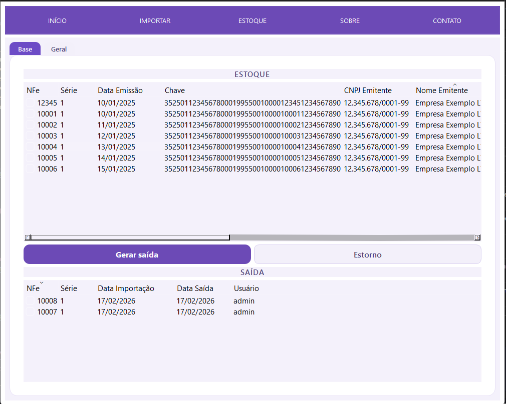
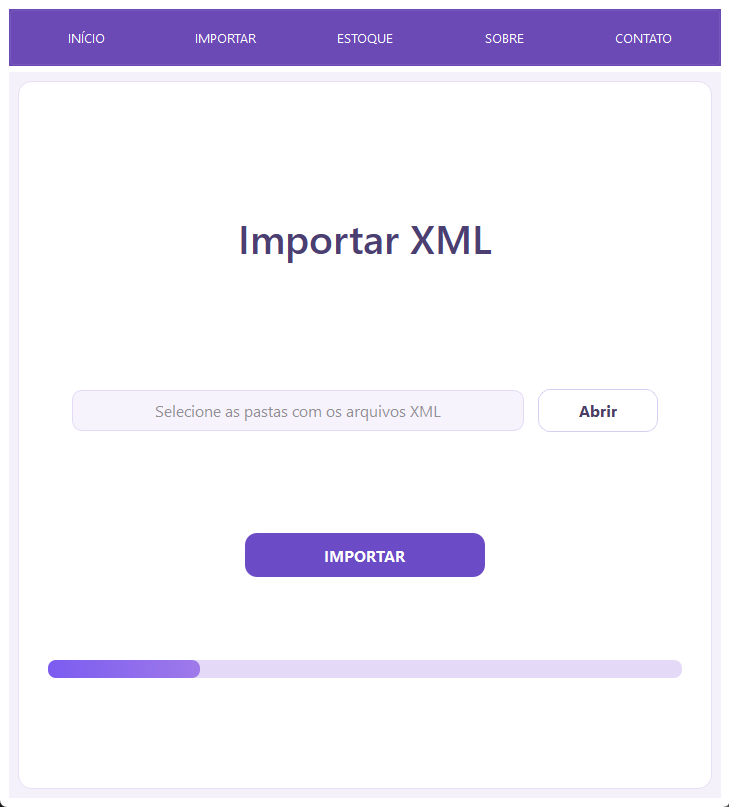
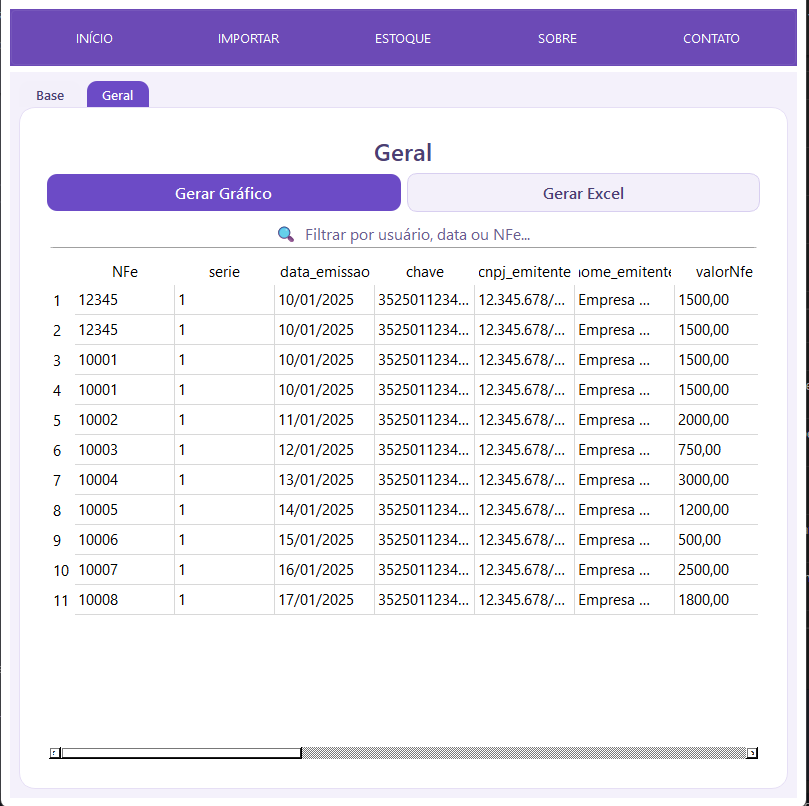

# Dashfy

Dashfy is a desktop inventory management system built with **Python and PySide6 (Qt)**, designed to streamline stock control through automated NF-e XML imports and structured operational workflows.

This project was developed as a portfolio application to demonstrate real-world problem solving, UI design consistency, and clean architecture separation between interface and business logic.

---

## 🚀 Key Features

- 🔐 User authentication with role-based access (Administrator / Common User)
- 📂 Bulk NF-e XML import with automatic parsing and database storage
- 📦 Inventory control with stock output and reversal (Estorno)
- 📊 General data view with filtering, Excel export, and pie-chart visualization
- 👥 User registration module with permission control
- 🎨 Consistent UI design styled with custom Qt stylesheets
- 🗄 Local database management using SQLite

---

## 📷 Screenshots

### 🔐 Login Screen


---

### 🏠 Home Dashboard


---

### 📦 Inventory Management


---

### 📂 XML Import


---

### 📊 General Data View


---
## 🧠 Problem Solved

Small operational teams often rely on spreadsheets to control invoice entries and stock movement, which can lead to inconsistencies and manual errors.

Dashfy automates:

1. XML parsing and item normalization  
2. Inventory tracking and stock status updates  
3. Movement history management  
4. Report generation for operational analysis  

Providing a structured and reliable inventory workflow.

---

## 🏗 Architecture Overview

The project follows a modular structure separating:

- UI layer (Qt Designer generated interfaces)
- Business logic
- Database operations
- XML parsing layer
```
DashFy/
├── main.py # Application entry point and UI event wiring
├── database.py # SQLite helpers and CRUD operations
├── xml_files.py # NF-e XML parsing and normalization
├── ui_login.py # Generated login UI
├── ui_main.py # Generated main UI
├── resources_rc.py # Qt compiled resources
├── system.db # SQLite database
├── xml/ # Example XML files
├── img/ # UI assets
└── main.spec # PyInstaller build configuration
```
---

## 🗄 Database Design

### Users Table
- `id` (Primary Key)
- `name`
- `user` (unique)
- `password`
- `access` (Administrator / User)

### Notas Table
Primary key: `(chave, NFe, itemNota)`

Stores:
- Invoice metadata
- Item-level information
- Import date
- Responsible user
- Stock status (`data_saida`)

---

## 🛠 Technology Stack

- **Python**
- **PySide6 (Qt)**
- **SQLite**
- **pandas**
- **matplotlib**
- **PyInstaller**

---

## ⚙️ How to Run

### Requirements
Python 3.10+

### Install dependencies

```bash
pip install PySide6 pandas matplotlib openpyxl

Initialize database
    python database.py

Start the application
    python main.py
```
---
📦 Build Executable

The project includes a PyInstaller specification file:
    pyinstaller main.spec

This generates a standalone executable version of the application.
---
🔮 Future Improvements

- Password hashing implementation

- Stronger input validation

- Multi-column dynamic filtering

- Unit testing for XML parsing and database operations

- REST API layer for future scalability
---
👩‍💻 About This Project

Dashfy was developed as a portfolio project to demonstrate:
- Desktop application architecture

- Database modeling and relational design

- XML parsing and structured data normalization

- UI/UX design with Qt and custom styling

- Operational workflow modeling

- Application packaging with PyInstaller
